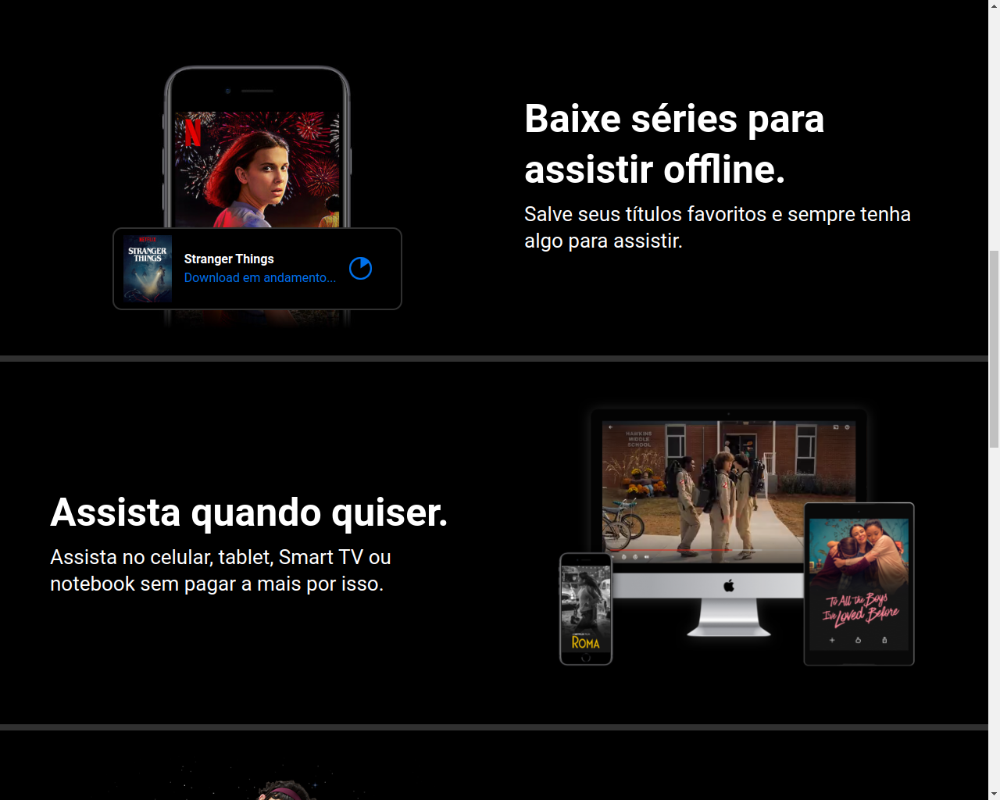
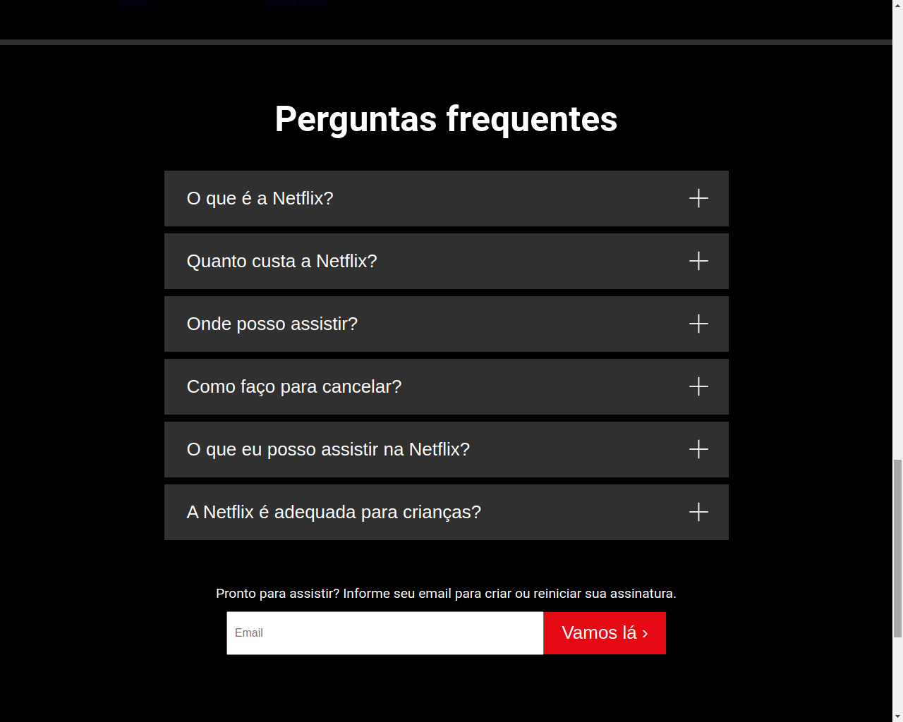

# Clone da página inicial da Netflix

- O projeto foi desenvolvido com Html, Css e Javascript Vanilla utilizando Vite.

## Índice

- [Visão Geral](#visao-geral)
  - [A ideia](#a-ideia)
  - [Screenshot](#screenshot)
  - [Links](#links)
  - [Como rodar o projeto](#como-rodar-o-projeto)
- [Meu processo](#meu-processo)
  - [Construído com](#construido-com)
  - [O que eu aprendi](#o-que-eu-aprendi)
- [Autor](#autor)

## Visao Geral

### A ideia

A ideia foi praticar Javascript componentizado com um projeto real.

### Screenshot





### Links

- URL do repositório: [solução](https://github.com/thiagoa-martins/netflix-clone)

### Como rodar o projeto

- Clone ou baixe e extraia o projeto.
- Entre na pasta do projeto.
- Digite o comando "npm i" sem as aspas para instalar o vite.
- Agora digite o comando "npm run dev" sem as aspas para rodar o projeto.
- Copie e cole essa url no navegador "http://localhost:3000/" sem as aspas.

## Meu processo

### Construido com

- Marcação HTML5 semântica
- Propriedades personalizadas de CSS
- Flexbox
- Primeiro fluxo de trabalho para desktop
- gitmoji
- Javascript (Vanilla) com Vite


### O que eu aprendi

Neste projeto pude desenvolver principalmente minhas habilidades com Javascript, conceitos de componentização retornando Html e Css com Javascript, arquitetura de pastas com ITCSS, e reutização de componentes.

```js
import "./style.css";

function LoginButton() {
    return /*html*/`
        <button class="login-button">Entrar</button>
    `;
}

export default LoginButton;


window.faqList = {};
    window.faqList.handleClick = (event) => {
        const $origin = event.target;
        const $li = $origin.closest("li");
        const $svg = $li.querySelector("svg");
        const $div = $li.querySelector("div");

        const $divClosed = $div.classList.contains("closed");

        if($divClosed) {
            $div.classList.remove("closed");
            $div.classList.add("open");

            $svg.classList.remove("svg-closed");
            $svg.classList.add("svg-open");
        } else {
            $div.classList.remove("open");
            $div.classList.add("closed");

            $svg.classList.remove("svg-open");
            $svg.classList.add("svg-closed");
        }
```

## Autor

- Github - [thiagoa-martins](https://github.com/thiagoa-martins)
- Twitter - [thiagoa_martins](https://www.twitter.com/thiagoa_martins)

<a href="https://gitmoji.dev">
  
</a>


